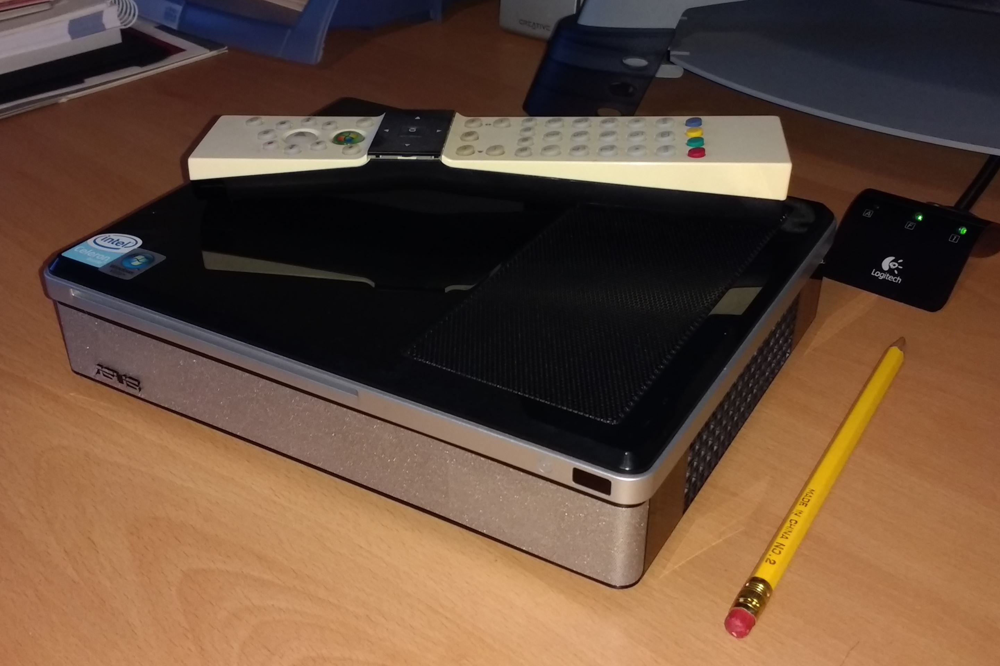
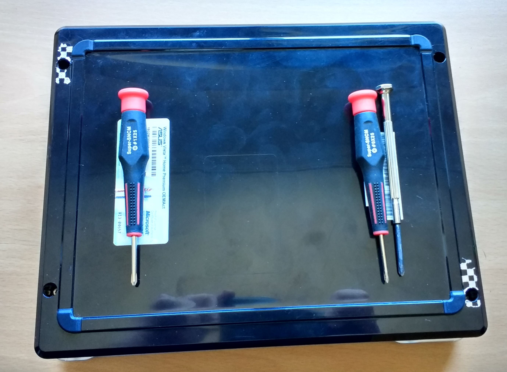
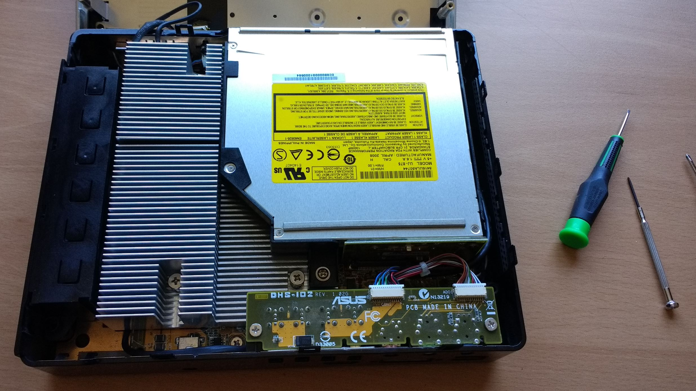
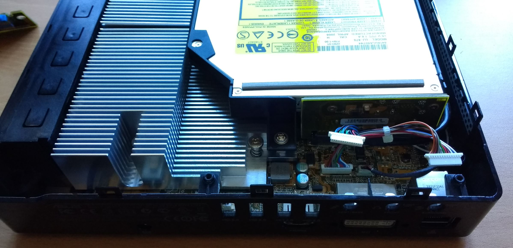
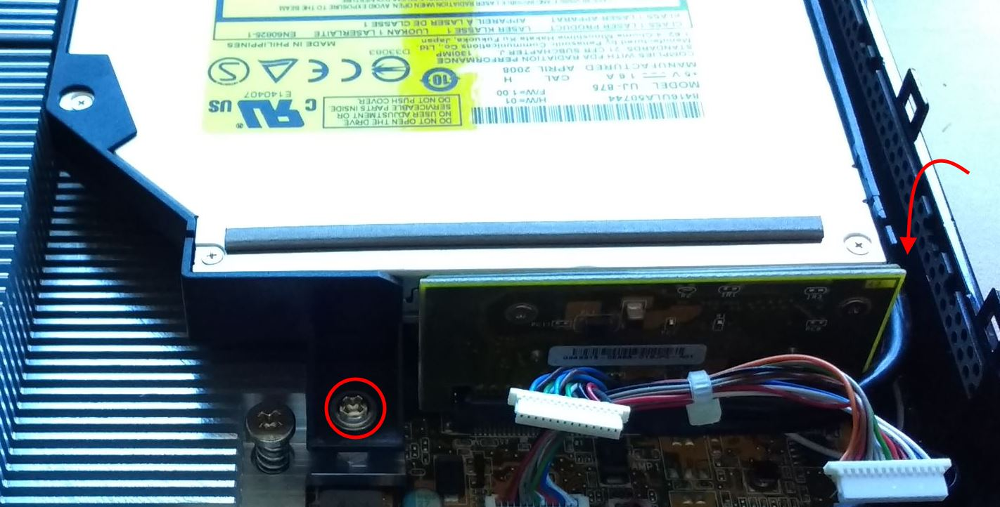
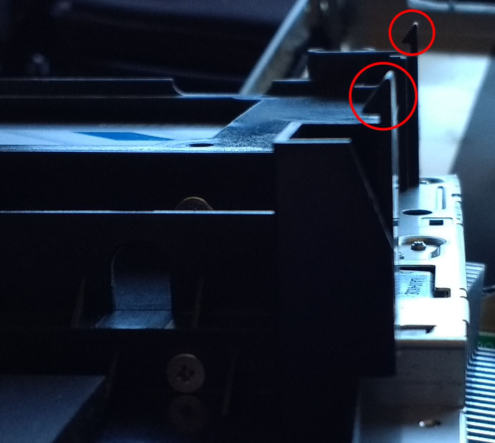
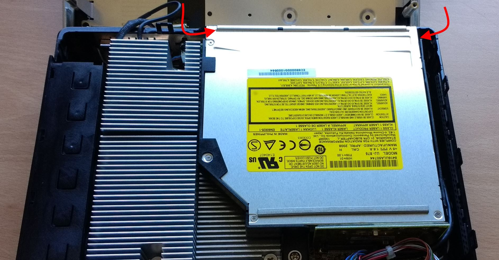
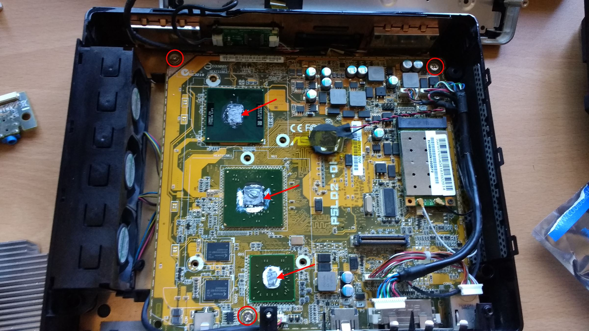
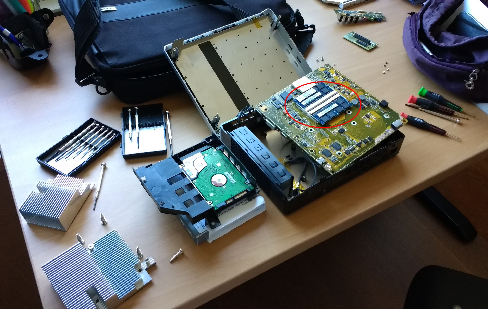

# How to disassemble an Asus Nova Lite/P20/P22 compact/barebones computer - Step by step

The **Asus Nova** line of computers consisted of a set of pretty cool devices that Asus used to sell a few years ago. Those devices were full-fledged Intel-based computers with Windows, packed into a small form factor box (a 'barebones'), designed with the TV in mind. 

Taking into account the cheap and powerful Android-powered specific products with the same purpose that we have today, in perspective the Asus Nova doesn't seem like such a good idea. And they were quite expensive. However they were a (more or less) silent general purpose computer inside a compact box. And they can work as an office computer or a small home server that you can have under a table or on the second floor at home, for example.

Since my Asus Nova Lite has turned 7 recently and it's not really a powerful computer anymore, I decided to upgrade it with more memory and a new 240Gb SSD hard drive (that cost me less than 60€, could you believe this just a couple of years ago?).

**To open the Asus Nova seemed pretty straightforward**, but due to the compact nature of the box, it was finally **much harder than I expected** to dismantle it. And the worst part is that **there aren't any instructions in the Internet** (or pictures, for that matter) that show how to do it correctly (or at least I wasn't able to find them).

That's the reason for writing this small step-by-step guide.

I hope it can help any other Asus Nova owners to do the same thing.

## Step 1. Open the box
You will need a star screwdriver. To be specific I used a Phillips PH-1 (2.5mm diameter), on the left of the picture below.

Turn the Nova Lite upside-down ad find the 4 screw holes shown in this picture:

Take into account that two of them are under a seal that you must break to access them. Don't' worry for the guarantee: nowadays is not active (for sure) ;-)

The upper box part has some plastic slots that keep it tied to the bottom part, so you must press slowly the top of the bottom part and pull up a little bit hard the top part to remove it.

Be careful when opening the box since it's top part is attached to the motherboard with two cables, for the power button and the leds. It's not a problem but simply be careful not to detach them.

## Step 2. Detach the ports controller board
Once you have the box open you'll see that it's jam-packed with components:

You need to get some extra space to operate. So, the first thing is to remove the ports controller board that is in the lower right part in the picture.

Just detach the two cables pulling them out of the white connectors, unscrew the two screws on the sides and pull gently to remove the piece. This should be the result:

This step is not mandatory but I found to be easier to operate in the tight space available if I got rid of this part.

## Step 3. Remove the disk tray
This is the most difficult part, and in fact the step that drove me crazy for a time (and a lot of other people on the Internet, to no avail, as I found out).

The black plastic part that holds the DVD and the hard drive below, has two screws that are very easy to find:

*(The second one on the right is not visible in the picture, but is located below the area the arrow is pointing to, and is very easy to spot)*

The problem is that, when you unscrew those two little motherfuckers, the tray is still fixed to the board on the front side.

**Don't try to locate any extra screws**: they are not there.

What is keeping the tray fixed are **a couple of plastic hooks** that are directly grabbing the motherboard from it's lower part, and **they are really hard to spot**.

To understand what I'm talking about, let's see them both once thee tray is removed:

You need to move them away from the motherboard and pull up the black plastic tray to remove it. They are located pretty close to the sides, in these locations:

I needed a strong light pointing at them to be able to spot them. Use a desk lamp or someone who helps with a torch and try to see them. It's not easy.

You can, however, move them even a little bit blindly. Use a thin stick (for example a thin slot screwdriver) to push them out and pull the plastic tray up gently. It takes a couple of tries but once you know this, it's easy-peasy.

> By the way, you can ease a little bit the operation getting rid of the connection board on the rear part of the disks. The rectangular green board on the back. It has only two screws and it's easy to remove.

Now, unscrewing the hard-drive and replacing it with the new one it's a matter of a couple of minutes.

It supports Serial ATA-300 type disks, but any modern ATA disk will downgrade and work without problem, including an SSD disk.

I tried to clone the original disk into my new SSD, but it took too long so I finally installed Windows 10 from scratch on the new disk.

## Step 4. Remove the heat sinks and the motherboard

The rest of the operation is straightforward.

Unscrew the two aluminum radiator heat sinks. They have a few screws with springs inside. Try not to remove them, just loosen them enough and lift the piece up to remove it without moving the screws from the holes. That will ease the operation of putting them back in place again.

## Step 5. Change the memory

The memory slots are **located under the motherboard**, so they are not visible yet.

The motherboard is fixed by three screws, very easy to spot:

>**IMPORTANT**: Take into account that, when putting all together again, you'll need to apply thermal paste to the 3 chips under the heat sinks, highlighted with arrows in the previous picture. That's an easy operation, and the thermal paste costs around 2-3 bucks in any computer store or in Amazon. If you don't do this, the computer will turn off automatically after a couple of minutes due to the heat those chips generate, so be careful.

Turn the motherboard upside down carefully, trying not to let loose the cables to much. There are a few cables attached to the board and fixed to the bottom of the box with scotch-tape. It's OK to unfix them, but the less you do it the less you need to fix them back later.

This is a picture that shows the memory slots and all the pieces scattered over my desk:

Change the memory cards for the new ones, and you're done.

The Asus Nova uses 2x 1GB DDR2 SDRAM modules. You can find 2x2GB modules like this in Amazon or eBay for less than 20 bucks.

>If you put 4GB in the computer, make sure you install a 64 bit version of Windows to take advantage of the new memory. Windows x32 is only able to use a maximum 3GB of RAM due to architecture limitations.

## Step 6. Put everything back in place
The final step is putting everything back in place again. And it's really easy. Just screw again backwards, and your done.

>Don't forget to use the thermal paste in the chips before screwing the heat sinks. It's important.

Now you have a small and powerful computer that you can use for multimedia, office work, Internet or to serve files or small websites from virtually any corner of your home or office.

**Hope this helps!**

## Disclaimer
I wrote this step-by-step guide trying to help other owners of this kind of PC to upgrade or fix their devices. I'm not responsible for any damage or mishap that can happen when you manipulate your computer. 

Always unplug it before open it, obviously. 

Be safe!

## Comments and contributions
If you want to **make any comments or questions**, just use the `Issues` section in this repository.

If you want to **contribute** with more detail to this instructions, fork the repo, make any changes or additions and do a pull request.

If you want to **translate** this instructions to other languages, fork the repo, create a new folder with your translation, and do a pull request.

Thanks!